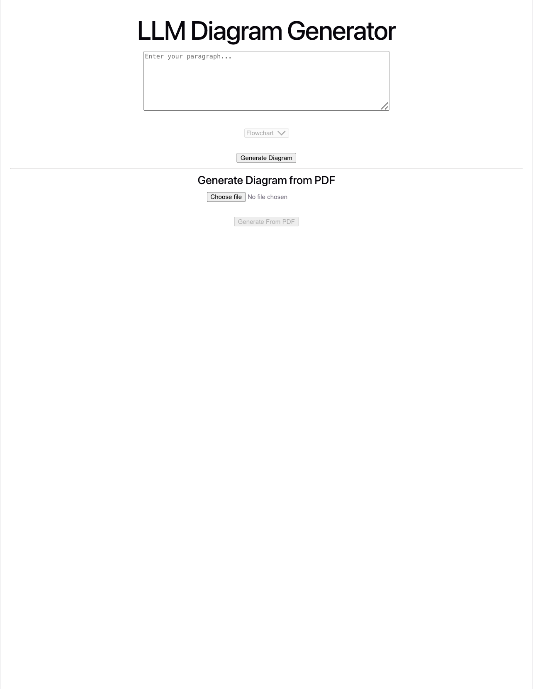
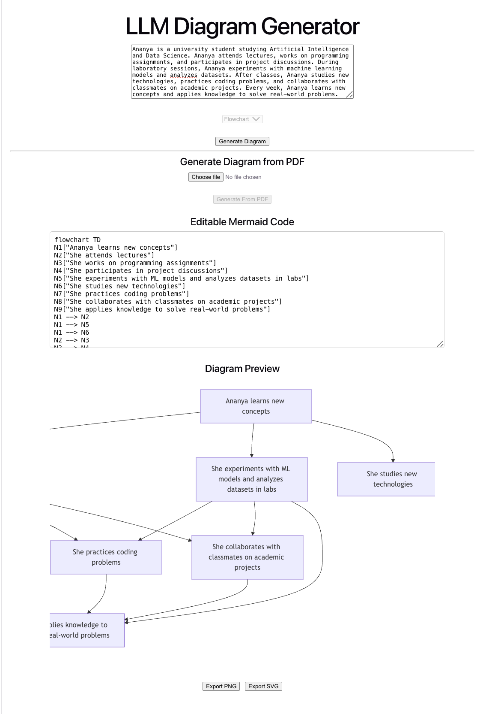
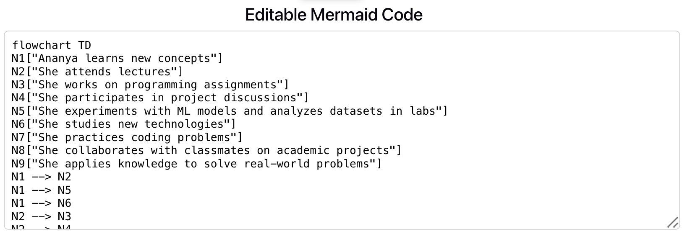

# LLM Diagram Generator

An AI-powered full-stack web application that transforms unstructured text and PDF documents into interactive workflow diagrams. The application leverages Google's Gemini API to understand textual workflows, automatically generates Mermaid diagrams, and provides an interactive interface for editing, previewing, and exporting diagrams.

## 🌐 Live Demo

**Frontend:** https://llm-diagram-generator.vercel.app

**Backend API:** https://llm-diagram-generator.onrender.com

---

## Features

* Convert plain text into workflow diagrams
* Generate diagrams directly from PDF documents
* AI-powered workflow extraction using Google Gemini
* Automatic Mermaid diagram generation
* Live editable Mermaid code editor
* Interactive diagram preview
* Export diagrams as PNG
* Export diagrams as SVG
* Responsive React frontend
* RESTful Flask backend

---

## Tech Stack

### Frontend

* React.js
* Vite
* Mermaid.js
* html-to-image

### Backend

* Flask
* Python
* Google Gemini API
* PyPDF
* Flask-CORS

### Deployment

* Vercel (Frontend)
* Render (Backend)
* GitHub

---

## Project Architecture

```text
                 User Input
              (Text or PDF)
                     │
                     ▼
           React + Vite Frontend
                     │
              REST API Request
                     │
                     ▼
              Flask Backend API
                     │
          PDF Text Extraction
             (for PDF input)
                     │
                     ▼
          Google Gemini API
     Workflow & Relationship Extraction
                     │
                     ▼
       Mermaid Code Generation
                     │
                     ▼
       Interactive Diagram Preview
                     │
        ┌────────────┴────────────┐
        ▼                         ▼
    Export PNG               Export SVG
```

---

## Workflow

```text
Text / PDF
      │
      ▼
Extract Text (if PDF)
      │
      ▼
Gemini Workflow Analysis
      │
      ▼
Node & Relationship Extraction
      │
      ▼
Mermaid Diagram Generation
      │
      ▼
Editable Mermaid Code
      │
      ▼
Interactive Visualization
      │
      ▼
PNG / SVG Export
```

---

## Screenshots

### Home Page



### Generated Diagram



### Editable Mermaid Code



### Exported Diagram



---

## Project Structure

```text
LLM-Diagram-Generator
│
├── backend/
│   ├── app.py
│   ├── gemini_utils.py
│   ├── pdf_utils.py
│   └── requirements.txt
│
├── frontend/
│   ├── src/
│   ├── public/
│   ├── package.json
│   └── vite.config.js
│
├── Screenshots/
├── README.md
└── .gitignore
```

---

## Installation

### Clone the Repository

```bash
git clone https://github.com/jayant186/LLM-Diagram-Generator.git
cd LLM-Diagram-Generator
```

### Backend Setup

```bash
cd backend

python -m venv venv

source venv/bin/activate        # macOS/Linux
# venv\Scripts\activate         # Windows

pip install -r requirements.txt

python app.py
```

Backend runs on:

```
http://localhost:5000
```

---

### Frontend Setup

```bash
cd frontend

npm install

npm run dev
```

Frontend runs on:

```
http://localhost:5173
```

---

## Environment Variables

Create a `.env` file inside the `backend` directory.

```env
GEMINI_API_KEY=YOUR_GEMINI_API_KEY
```

---

## Future Improvements

* Support for additional Mermaid diagram types
* RAG-based document understanding
* Multi-page PDF processing
* Drag-and-drop diagram editing
* User authentication
* Cloud storage integration
* Diagram history and versioning

---

## License

This project is intended for educational and portfolio purposes.
